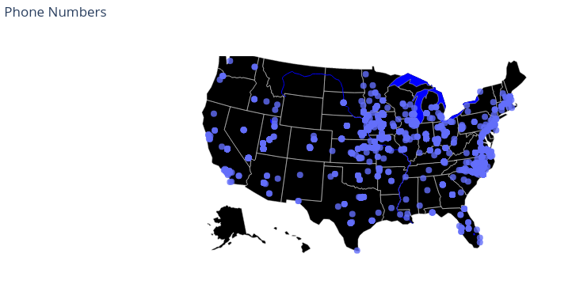

# Mapping Cell List

Original Dataset:

`4468 phone numbers in a csv file`

A phone number anatomy: 

`<Country Code>-<Area Code>-<Exchange>-<Subscriber>`

Ex: `+1-757-723-6343`

Steps:
- Anonymize the Data (Remove last four digits and generate fake names)
- Data Preparation: Retrieve Area Code & Exchange
- Read in Phone Numbers & create list of unique Area Codes
- Scrape Exchange Information from Website for each Area Code
  - Website with Exchange Information : https://us-places.com/phone-exchanges.php
- Clean the Exchange Lists
- Integrate Exchange Lists into Data Frame 
- Retrieve Geolocations & Append Columns

## Plot Geolocations on map of US

